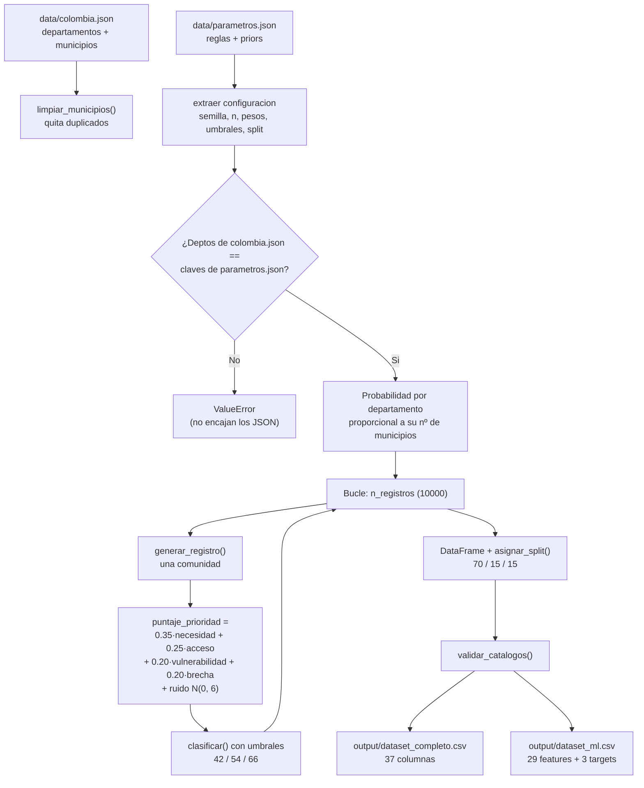
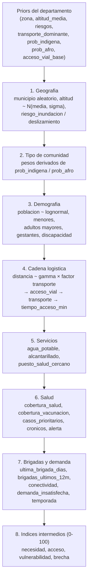
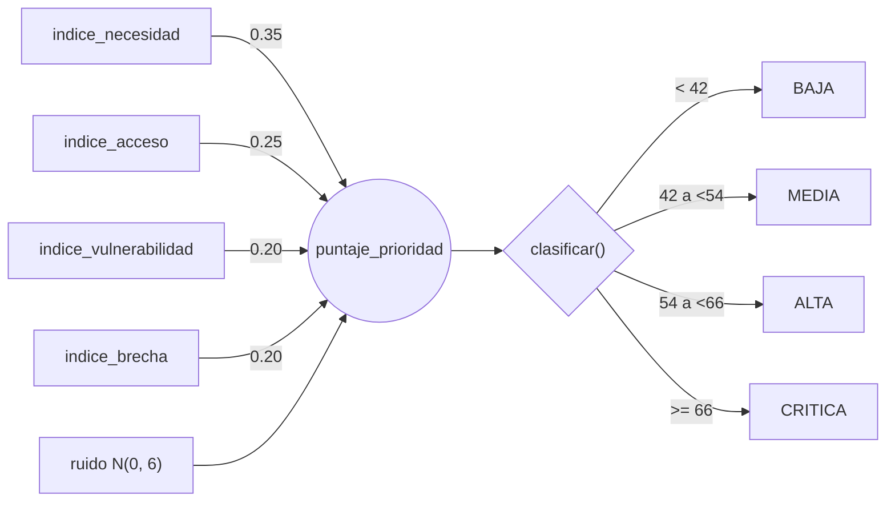

# Diagrama del flujo de `generar_dataset.py`

Documento de apoyo para entender como interactuan `data/colombia.json` y
`data/parametros.json` para producir `output/dataset_completo.csv` y
`output/dataset_ml.csv`.

---

## 1. Flujo general (`main()`)

---

## 2. Construccion de una comunidad (`generar_registro()`)

El registro se genera en orden causal: cada variable depende de las anteriores,
por lo que las combinaciones son coherentes.

---

## 3. De los indices al target

---

## 4. Que aporta cada JSON

| Fuente | Contenido | Se usa en |
|---|---|---|
| `colombia.json` | 32 departamentos con su lista de municipios | Sorteo del departamento y del `municipio` |
| `parametros.json` → `semilla`, `n_registros` | Reproducibilidad y tamaño | `main()` |
| `parametros.json` → `ruido_puntaje` | Desvio del ruido del puntaje | Calculo de `puntaje_prioridad` |
| `parametros.json` → `split` | Proporciones train/val/test | `asignar_split()` |
| `parametros.json` → `prioridad` | Pesos de los 4 indices | Calculo del puntaje |
| `parametros.json` → `clasificacion` | Umbrales 42/54/66 | `clasificar()` |
| `parametros.json` → `catalogos` | Valores validos de las categoricas | `elegir()` y `validar_catalogos()` |
| `parametros.json` → `departamentos` | Priors por departamento | `generar_registro()` |

**Punto clave de acoplamiento:** el conjunto de `departamento` de `colombia.json`
debe ser identico a las claves de `departamentos` en `parametros.json`; si no,
el script aborta con `ValueError`.
